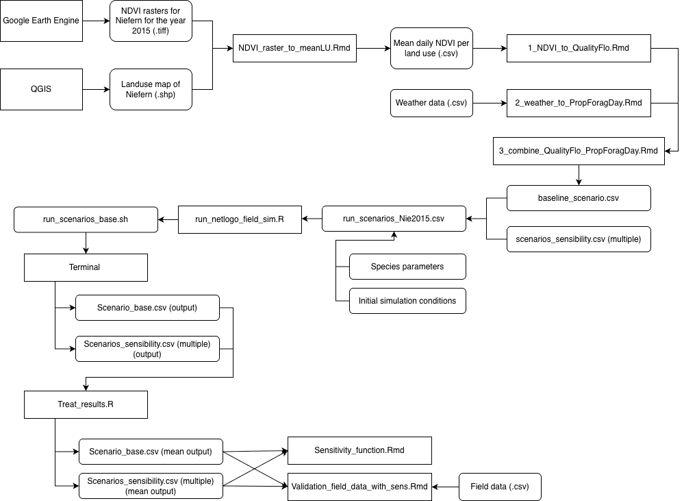

# BIO7019_project

L'illustration suivante montre le fonctionnement général du code. 

Les rasters NDVI correspondant au site et à la période d’étude (Ruddle et al., 2017) sont d’abord extraits via Google Earth Engine. Le territoire est ensuite découpé en zones cultivées, semi-naturelles et urbaines grâce à QGIS.
Les NDVI sont ensuite moyennés par type d’occupation du sol et par date d’acquisition satellitaire (script *NDVI_raster_to_meanLU.Rmd*). Une interpolation linéaire est réalisée pour obtenir une série temporelle continue.
Ces étapes sont reprises dans le dossier *Nierfen_NDVI*. 

Le traitement des données NDVI dans le cadre de la production des variables de ressources florales est localisé dans le dossier *Run_scenatios > QualityFlo_treatment*.
Dans *1_NDVI_to_QualityFlo.Rmd*, une méthode de seuil est appliquée pour détecter les périodes de floraison. À l’intérieur de ces périodes, la qualité florale est calculée pour les zones cultivées et semi-naturelles grâce à une normalisation du NDVI. Ces deux séries temporelles (*Quality_crop* et *Quality_nat*) sont ensuite utilisées pour calculer la proportion de butinage sur culture (*Prop_foraging_crop*), via un ratio entre *Quality_crop* et la somme des ressources disponibles. 

La proportion journalière de butinage est ensuite déterminée à partir des conditions météo dans le script *2_weather_to_PropForagDay.Rmd*.

Les quatre variables florales sont ensuite regroupées dans *3_combine_.Rmd* afin de produire un fichier unique de ressources florales, utilisé comme scénario de base par le modèle. L’analyse de sensibilité (non représentée dans la figure) génère également un ensemble de fichiers floraux alternatifs.

L'ensemble de ces scenarios se trouvent dans le dossier *Run_scenatios > QualityFlo_scenarios*. 
Tous ces scénarios sont ensuite listés dans le fichier run_scenarios_Nie2015.csv, qui sert d’entrée au script run_netlogo_field_sim.R. Ce script génère un fichier .sh permettant d’exécuter automatiquement le modèle SolBeePop sous NetLogo. Chaque scénario est simulé 50 fois, en utilisant différentes graines aléatoires, afin de prendre en compte la stochasticité du modèle et d’assurer la robustesse des résultats.

Enfin, les sorties du modèle résultats sont traitées dans le dossier *run_scenarios > Results_analysis*.
*Treat_results.R* réorganise et moyenne les sorties du modèle (par jour et par scénario), en combinant les 50 répétitions.  Ces sorties traitées sont ensuite utilisées pour les analyses de sensibilité et de validation. Le script Sensitivity_function.Rmd applique une fonction de sensibilité locale afin d’identifier les paramètres les plus influents, tandis que Validation_field_data_with_sens.Rmd compare les variables de sortie du modèle aux données de terrain, en incluant également les scénarios associés aux paramètres identifiés comme les plus influents.

