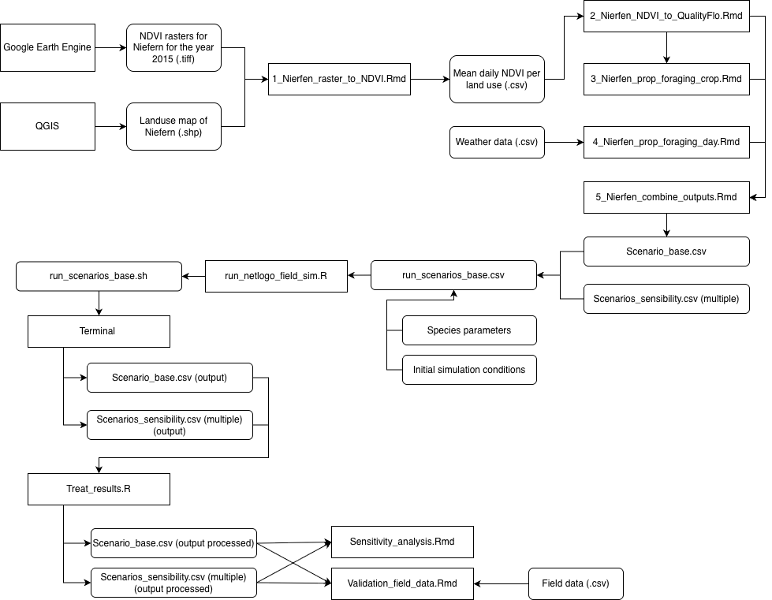

# BIO7019_project

L'illustration suivante montre le fonctionnement général du code. 

Les rasters NDVI correspondant au site et à la période d’étude (Ruddle et al., 2017) sont d’abord extraits via Google Earth Engine. Le territoire est ensuite découpé en zones cultivées, semi-naturelles et urbaines grâce à QGIS.

Les NDVI sont ensuite moyennés par type d’occupation du sol et par date d’acquisition satellitaire (script *1_Nierfen_raster_to_NDVI.Rmd*). Une interpolation linéaire est réalisée pour obtenir une série temporelle continue.

Dans *2_Nierfen_NDVI_to_QualityFlo.Rmd*, une méthode de seuil est appliquée pour détecter les périodes de floraison. À l’intérieur de ces périodes, la qualité florale est calculée pour les zones cultivées et semi-naturelles grâce à une normalisation du NDVI.

Ces deux séries temporelles (*Quality_crop* et *Quality_nat*) sont ensuite utilisées dans *3_Nierfen_prop_foraging_crop.Rmd* pour calculer la proportion de butinage sur culture (*Prop_foraging_crop*), via un ratio entre *Quality_crop* et la somme des ressources disponibles.

La proportion journalière de butinage est ensuite déterminée à partir des conditions météo dans le script *4_Nierfen_prop_foraging_day.Rmd*.

Les quatre variables florales sont ensuite regroupées dans *5_Nierfen_combine_outputs.Rmd* pour produire le fichier unique de ressources florales utilisé par le modèle. L’analyse de sensibilité (non représentée dans la figure) génère également un ensemble de fichiers floraux alternatifs.

Tous les scénarios sont ensuite listés dans *run_scenarios.csv*. Ce fichier sert d’entrée à *run_netlogo_field_sim.R*, qui génère un fichier .sh pour exécuter SolBeePop sous NetLogo. Chaque scénario est simulé 50 fois, avec différentes random seeds, afin d’assurer la robustesse des résultats.

Enfin, *Treat_results.R* réorganise et moyenne les sorties du modèle (par jour et par scénario), en combinant les 50 répétitions. Ces fichiers de sortie traités sont ensuite utilisés dans les analyses de sensibilité et de validation.
