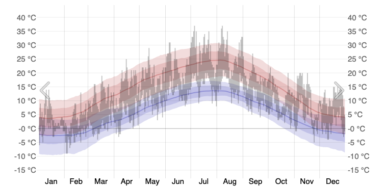
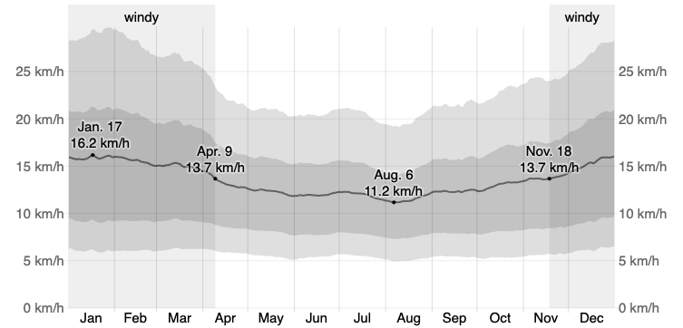
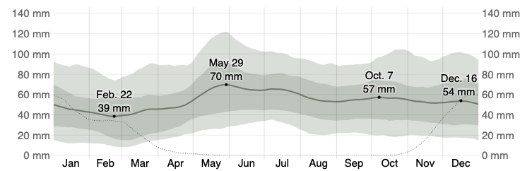

```{r setup, include=FALSE}
knitr::opts_chunk$set(echo = TRUE)
```

# Prepare R environment 

```{r load packages}
rm(list = ls())
library(ggplot2)
library(here)
```

```{r set directories}
wd_file <- here("run_scenarios/QualityFlo_treatment")
out_file <- here("run_scenarios/QualityFlo_treatment/Intermediate_results")
setwd(wd_file)
```

The weather data for Nierfen is given by the Ruddle and al. (2017) study, however it's only available for part of the year (04-21 -> 06-09).
```{r load weather data Ruddle}
weather_Ruddle <- read.csv("Weather_Ruddle_et_al_study_2015_Nie.csv", skip = 5)
head(weather_Ruddle)

colnames(weather_Ruddle) <- c("date", "DOY", "T_mean", "T_max", "T_min", "Precip", "RH")
weather_Ruddle$date <- as.Date(weather_Ruddle$date)
head(weather_Ruddle)
```

# Set threshold meteorological values 
From Drummond (2016) and Drummond et al. (2017), we have these daily threshold values that impact foraging: 

* Minimum temperature = 18°C (Drummond 2016, Drummond et al. 2017)
* Maximum wind speed = 7.2 m/s = +/- 26 km/h
* Maximum precipitation = 25.4 mm
* Maximum humidity = 60% - 100% depending on the source

```{r threshod values}
min.temp <- 18
max.precip <- 25.4
max.humid <- 80
```

As said before, the weather data is only available for part of the year (04-21 -> 06-09). Due to this limitation, the 2015 weather history from the Stuttgart Airport is also being shown (not available for free download) (https://weatherspark.com/y/60731/Average-Weather-in-Niefern-Öschelbronn-Baden-Württemberg-Germany-Year-Round#google_vignette)

# Plot
```{r plot weather data and thresholds}
# 3 subplots in 1 col
par(mfrow = c(3, 1), mar = c(4, 4, 2, 1))

## Graph with T_max + threshold min.temp
plot(weather_Ruddle$date, weather_Ruddle$T_max,
     type = "l",
     xlab = "Date",
     ylab = "T_max (°C)",
     main = "Température max quotidienne")
abline(h = min.temp, col = "red", lty = 2, lwd = 2)
legend("topright", legend = paste("Seuil :", min.temp, "°C"),
       lty = 2, lwd = 2, col = "red", bty = "n")

##Graph with Precip + threshold max.precip
plot(weather_Ruddle$date, weather_Ruddle$Precip,
     type = "h",
     xlab = "Date",
     ylab = "Précipitation (mm)",
     main = "Précipitations quotidiennes")
abline(h = max.precip, col = "blue", lty = 2, lwd = 2)
legend("topright", legend = paste("Seuil :", max.precip, "mm"),
       lty = 2, lwd = 2, col = "blue", bty = "n")

## Graph with RH + threshold max.humid
plot(weather_Ruddle$date, weather_Ruddle$RH,
     type = "l",
     xlab = "Date",
     ylab = "Humidité relative (%)",
     main = "Humidité relative quotidienne")
abline(h = max.humid, col = "darkgreen", lty = 2, lwd = 2)
legend("topright", legend = paste("Seuil :", max.humid, "%"),
       lty = 2, lwd = 2, col = "darkgreen", bty = "n")
```



We can consider from this graph that, outside of the May -- October interval, the temperature doesn't allow for foraging (<18°C).



We can consider from this graph that the wind speed won't bee a limiting factor. In addition, the Ruddle and al. (2017) data doesn't account for wind data. 



Since the data is in a montly format, we cannot deduct any relevant information execpt that rainfall is more intense in summer, where we have weather data from Ruddle et al. (2017).

From all these graphs, we can deduct that **outside of the May-October interval, the proportion of foraging per day is null**. Then we'll make an optimistic hypothesis that **from 2015-06-10 to 2015-10-01**, the interval where we consider that there is foraging but we don't have any real data, **the proportion of foraging per day will be set at 1. **

For the time intervall (**from 2015-04-21 to 2015-06-09**) where we do have daily data from Ruddle et al. (2017), **the proportion of foraging per day will either be set to 1 or 0 based on the thresholds defined earlier**. 

# Creation of out dataframe 

```{r resulting dataframe}
# Creation of the prop_forag_day dataframe with a date column
prop_forag_day <- data.frame(matrix(NA, nrow = 365, ncol = 2))
colnames(prop_forag_day) <- c("date", "Prop_foraging_day")

prop_forag_day$date <- seq(from = as.Date("2015-01-01"),
                           to = as.Date("2015-12-31"),
                           by = "day")


# Definition of time intervals where Prop_forag_day will be set to 0/1
set_interval <- function(df, start, end, value){
  df$Prop_foraging_day[df$date >= as.Date(start) &
                       df$date <= as.Date(end)] <- value
  return(df)
}

## Prop_foraging_day set to 1 from 2015-06-10 to 2015-10-01
prop_forag_day <- set_interval(prop_forag_day, "2015-06-10", "2015-10-01", 1)

##Prop_foraging_day set to 0 from 2015-10-02 to 2015-12-31 AND from 2015-01-01 to 2015-04-20
prop_forag_day <- set_interval(prop_forag_day, "2015-10-02", "2015-12-31", 0)
prop_forag_day <- set_interval(prop_forag_day, "2015-01-01", "2015-04-20", 0)


# Calculate prop_foraging_day based on meteorological data
## Join prop_forag_day and weather data by date
df <- merge(
  prop_forag_day,
  weather_Ruddle[, c("date", "T_max", "Precip", "RH")],
  by = "date",
  all.x = TRUE
)

# Create a vector which specifies which rows satisfy the meteo conditions 
ok <- is.na(df$Prop_foraging_day) & #Only take into account the NA values in prop_foraging_day
      df$T_max  > min.temp   &
      df$Precip < max.precip &
      df$RH     < max.humid

df$Prop_foraging_day[ok] <- 1 #If all conditons ok then prop_foraging_day = 1

df$Prop_foraging_day[is.na(df$Prop_foraging_day)] <- 0 #Otherwise, prop_foraging_day = 0

# Put the results back into the original df 
prop_forag_day$Prop_foraging_day <- df$Prop_foraging_day


prop_forag_day
```
# Plot
```{r plot both prop_foraging_day}
ggplot(prop_forag_day, 
       aes(x = date,
           y = Prop_foraging_day)) +
  geom_line(alpha = 0.7) 
```

# Save the results 
```{r write csv}
write.csv(prop_forag_day,
          paste(out_file, "/baseline_PFD.csv",
              sep=""))
#PFD = PropForagingDay
```